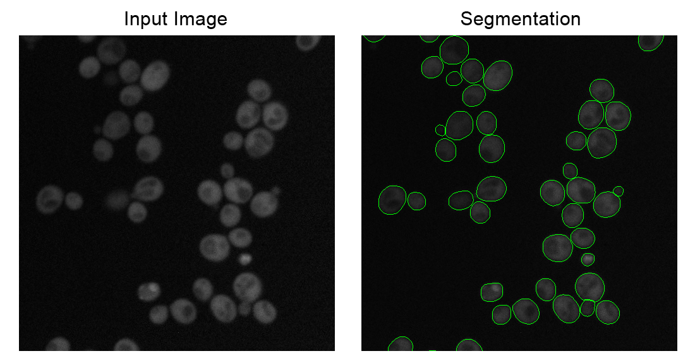
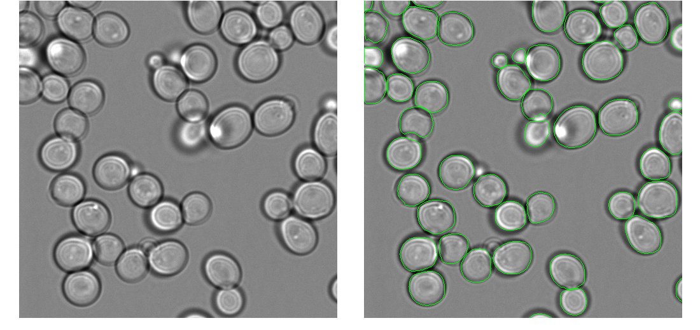

# User-friendly Mask-RCNN Segmentation for Yeast Cells

Code to segment yeast cells using a pre-trained mask-rcnn model. We've tested this with yeast cells imaged in fluorescent images and brightfield images, and gotten good results with both modalities. This code implements an user-friendly script that hides all of the messy implementation details and parameters. Simply put all of your images to be segmented into the same directory, and then plug and go. 

(Adapted from the code of Deep Retina from the Kaggle 2018 Data Science Bowl, all credit for training models and wrangling the Mask-RCNN code goes to them: https://github.com/Lopezurrutia/DSB_2018)

## Downloading the Weights
For this model to work, you will need the pre-trained weights for the neural network, which are too large to share on GitHub. You can grab them from our webserver as a zip file (http://hershey.csb.utoronto.ca/weights.zip) or from Zenodo (https://zenodo.org/record/3598690).

Once downloaded, simply unzip, so that there is a sub-directory called "weights" containing a file called "deepretina_final.h5" in the same directory of the segmentation.py and opts.py scripts. 

## Instructions
1. Put all of the images you want to segment in one directory (this will be the input directory).
2. Modify the opts.py file to point to the input directory, as well as the output directory to write the segmentations to (this directory should be empty). You can change various settings here, including what immediate files to write, and whether to rescale the images during segmentation to speed up the process.
3. Run "python segmentation.py", and the script should handle everything from preprocessing to feeding into the neural network to post-processing. You're done! 
4. The output will be an integer-labeled image. Background is assigned a value of 0, and each individual cell is assigned an integer in incremental order (e.g. 1, 2, 3...) Stay tuned for some scripts to upload these files into ImageJ, Matlab, and Python for subsequent analysis soon.

## Examples of Segmentation

These examples were produced from the same model, with the same parameters. There is no need to manually specify any parameters when switching between modalities or images from different microscopes. 

